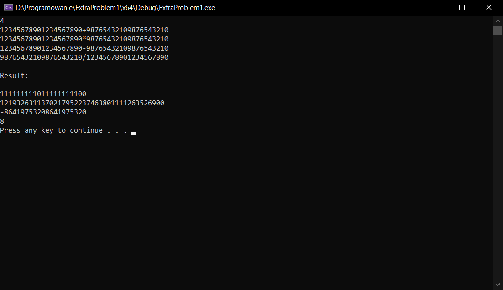

# ExtraProblem1

The program calculates multiplication, division, addition, subtraction of large numbers. At the beginning, you need to write the number of examples you want to calculate (From 1 to 200). Next, insert the examples you want to calculate. Calculation results will appear after the word "Result: ".
<u> Examples must be written without spaces between the separating sign (example on the screenshot) </u>
